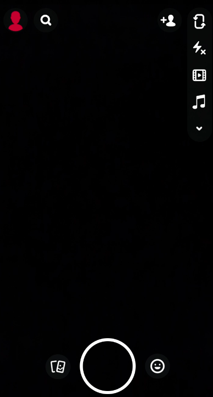
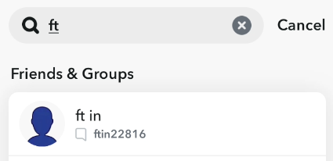
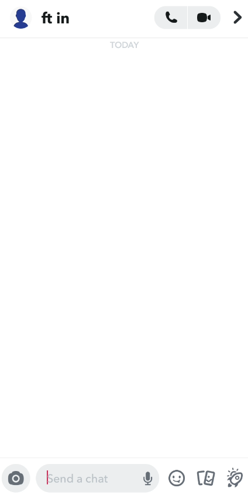

# autoSnapchat
A bot that automatically sends snaps to a connected android phone

The program works by extracting all of Snapchat's icon pixel data off of four screenshots
that you must take of the app itslef. Becauase of this, you need an andriod phone with Snapcaht displaying it's screen onto your computer screen so the program can interact with the phone.
# Setting up client device

## Setting up an emulator
**Snapchat does not allow emulators so there is a chance things might not work or snapchat will
refuse to run**

An alternative is also to install snapchat on an emulator like Bluestacks 5 (Windows/MacOS)
or Genymotion (Linux) if you do not want to use real hardware. To install bluestacks click [here](https://www.bluestacks.com/download.html) or to install 
Genymotion click [here](https://www.genymotion.com/download/).

Installing snapchat on bluestacks should be as simple as going to the play store and installing it
from there. If your computer does not have a camera, you can install [iriun webcam](https://iriun.com/) to emulate a fake camera for your Windows computer.

To use Snapchat on Genymotion, you should pick an andriod phone with andriod 9. Once you install
a phone, you will need arm to x86_64 translation zip which can be found [here](https://github.com/m9rco/Genymotion_ARM_Translation).
Once you install the zip file, just drag onto the phone. Then you need to find the latest apk for 
Snapchat which can be found [here](https://www.apkmirror.com/?post_type=app_release&searchtype=apk&s=snapchat). Choose the latest version and drag it onto the phone and snapchat should be installed.
However, as of now you can only send messages and cannot send snaps.

## Setting up andriod phone
The best way to display your andriod phone's screen to your computer's screen is using
the open-sourced program called scrcpy.

To install go to there github [here](https://github.com/Genymobile/scrcpy) and read the instruction on how to get scrcpy working running on your system.

On your phone you will have to also enable usb debugging. To do this, follow this guide right [here](https://developer.android.com/studio/command-line/adb#Enabling)

As a bonus and to increase phone speed, you can also disable its keyboard. Go to the play store and
install an application called No Keyboard by Vishnu N K. Once installed the app will give you instructions on how to disable its virtual keyboard

# Setting up host device

To get autoSnapchat to work you must have the latest version of python 3 installed

To check run 'python3 --version' in your terminal / powershell

If it says Python 3.10.x you can continue; however, if you get an error or
have any version older continue go to the website and download the latest version [here](https://www.python.org/downloads/). For linux users, you can follow this [guide](https://opensource.com/article/20/4/install-python-linux)

Once installed run 'pip3 install pillow pyautogui opencv-python'
If on Linux you will also have to install scrot, python3-tk,  python3-dev

if pip not installed check [here](https://pip.pypa.io/en/stable/installation/) for how to install it

Then either get the zip file for autoSnapchat from here or run 
'git clone https://github.com/Crafterzilla/autoSnapchat' to get all the program onto your computer

# Using the program

Once you have downloaded the files onto your computer, run 'python3 autoSnapchat' where the file was downloaded to run the program.

Once the program is running, choose configure phones. To make it so you do not have to put in the coordinates as to where the program has to click, the program will scan your screen to find where snapchat is but it needs to be given four screenshots first.

Choose add phone and you should see example listed as a phone.
Run scrcpy or your andriod emulator and take four partial screenshots. This will vary on different devices, but on Windows it is usually 'windows, shift, and s' while on linux it is usually is 'PrtSc' 
Look it up if that does not work.

The first screenshot should look like this 

The second screenshot should look like this 

The third screenshot should look like this 

The fourth screenshot should look like this 

or like this

Once you have taken those screenshots, they usually will be in your Pictures directory in your home directory. Find them and rename them exactly to how they appear in the example in repo or where the program is on your computer. The program will tell your exaclty to which directory to place them in.

Once it's done calculating the icons, check to ensure the icons it got are correct as there is a chance that they won't all be right. If one of them is wrong, look at how the example icon looks, and retake that screenshot of that icon manually. Be sure to name it exaclty how it appears in icons or else the program will break.

Once this is done, as long as the window where the phone is open is not stretched or moved to a screen with a differnt scaling factor, you will no longer have to reprogram the phone. If you do this, you will have to reprogram the phones screenshots again

After this, most things are explained within the program itself.

Anyways have fun farming snapscore and stuff ig lol